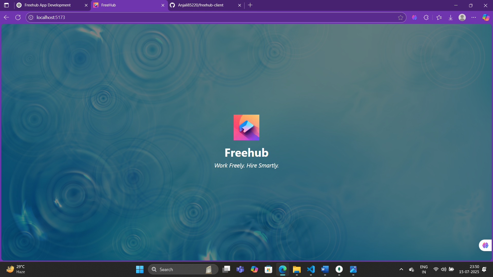
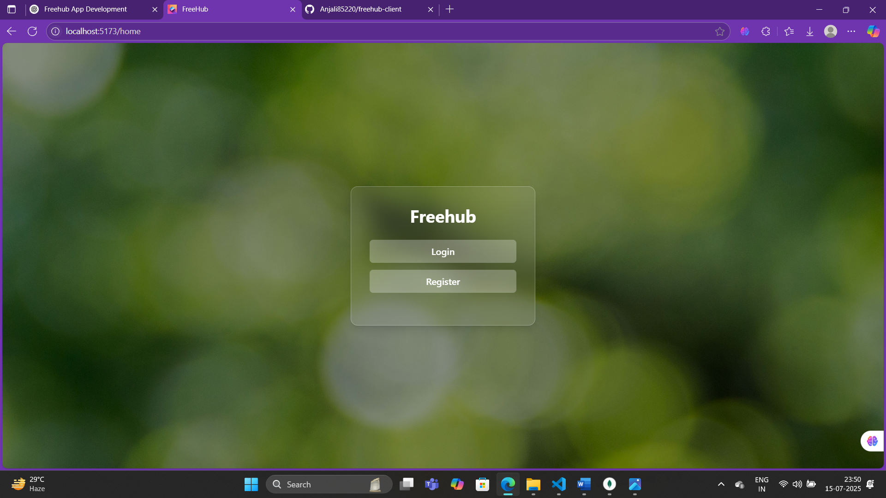
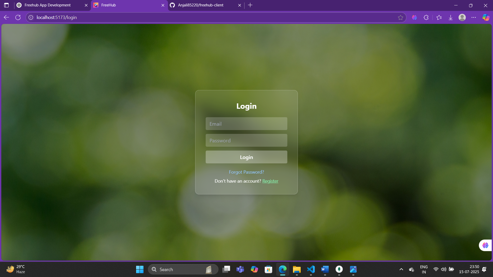
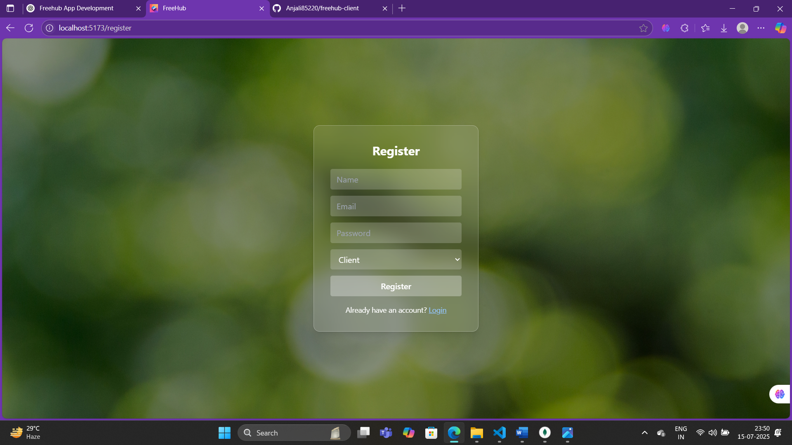
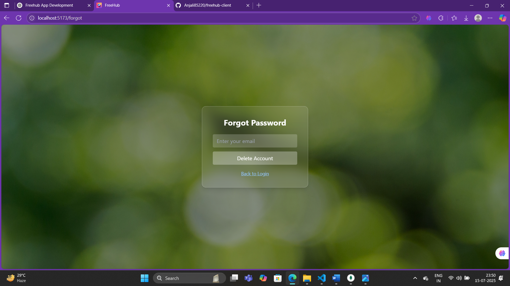

# 🚀 Freehub Client

Freehub is a modern freelancer marketplace platform where clients and freelancers connect, collaborate, and grow — built with React and Tailwind CSS.

This is the **frontend (client-side)** of the Freehub application.

---


## 🧰 Tech Stack

- ⚛️ React.js
- 💨 Tailwind CSS
- 🌐 React Router DOM
- 🎨 Glassmorphism UI
- 🔐 JWT-based Auth (via backend)
- 📦 Vite for fast development

---

## ✨ Features

- Splash screen with app logo, slogan, and illustration
- Home screen with Login / Register
- Glassmorphic authentication pages
- Route navigation using `react-router-dom`
- Forgot Password functionality (re-register same email)
- Fully mobile responsive
- Custom background + vector illustrations

---

## 📦 Folder Structure

freehub-client/
├── public/
│ ├── bg-home.jpg
│ ├── hero-image.png
│ └── logo.png
├── src/
│ ├── pages/
│ │ ├── Splash.jsx
│ │ ├── Home.jsx
│ │ ├── Login.jsx
│ │ ├── Register.jsx
│ │ └── Forgot.jsx
│ ├── App.jsx
│ └── main.jsx
├── screenshots/
│ ├── splash.png
│ ├── home.png
│ ├── login.png
│ ├── register.png
│ └── forgot.png
└── README.md

## 🛠️ Setup Instructions

### 1. Clone the repository

```bash
git clone https://github.com/Anjali85220/freehub-client.git
cd freehub-client

2. Install dependencies
npm install

3. Start the development server
npm run dev


🔐 Auth Flow Summary
User registers → redirected to login

User logs in → token + user data saved in localStorage

Login required for dashboard access

Forgot Password lets user re-register with same email

📸 Screenshots


### 🚀 Splash Screen


### 🏠 Home Page


### 🔐 Login Page


### 📝 Register Page


### ❓ Forgot Password Page


🤝 Contributors
💻 Shivanjali Dumpala


📄 License
This project is open-source and available under the MIT License.